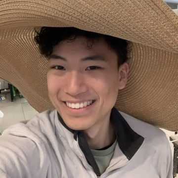

<!-- style -->
<link rel="stylesheet" href="/assets/css/styles.css">

{:style="float: right; padding: 30px; max-width: 30%; min-width: 330px;"}

 
Hi! I'm a 4th year undergrad at [UC Berkeley](https://www.berkeley.edu) studying Electrical Engineering and Computer Science (EECS), interested in LLMs. 

*This site is very much in progress!*

<!-- I'm broadly interested in Reinforcement Learning and Robot Learning. 
Currently, I work on Policy Extraction for generative offline RL algorithms, and offline-to-online RL for robotics at [BAIR](https://bair.berkeley.edu), in professor [Sergey Levine](https://people.eecs.berkeley.edu/~svlevine/)'s group. I've also had the chance to work on Test-Time policy improvement methods as an OpenAI research fellow, and online RL for VLA exploration and post-training with the [GEAR](https://research.nvidia.com/labs/gear/) team at NVIDIA. I'll also be working on RL research as a QR at Jump Trading this summer. Previously, I've built LLM Infra with the ChipNemo team at NVIDIA, and worked on high-speed simulations on FPGAs for Robotaxi charging at Tesla. Outside research, I spend my time with friends at [Cal Launchpad](https://launchpad.studentorg.berkeley.edu), and playing IM basketball.

If you'd like to chat, please reach out at [andypeng at berkeley dot edu]. -->

---

<!-- ## Publications

<table class="pub-table" style="width:100%;border:0px;margin-right:auto;margin-left:auto;">
  <tbody>
    <tr>
      <td class="pub-image-cell">
        
      </td>
      <td class="pub-text-cell">
        

        <strong>Test-Time Gradient Guidance of Flow Policies in Reinforcement Learning</strong>
        

        <a href="https://zhouzypaul.github.io">Zhiyuan Zhou</a>,
        Andy Peng,
        <a href="https://charlesxu0124.github.io/">Charles Xu</a>,
        <a href="https://colinqiyangli.github.io/">Qiyang Li</a>,
        <a href="https://aldeia.uk">Jost Tobias Springenberg</a>,
        <a href="https://kvfrans.com/">Kevin Frans</a>,
        <a href="https://people.eecs.berkeley.edu/~svlevine/">Sergey Levine</a>
         
        <em>Preprint</em>, 2026
         
        [<a href="https://arxiv.org/pdf/2606.11087">paper</a>]
        [<a href="https://q-guided-flow.github.io">website</a>]
      </td>
    </tr>
    <tr>
      <td class="pub-image-cell">
        
      </td>
      <td class="pub-text-cell">
        

        <strong>Self-improving Vision-Language-Action models with data generation via Residual RL</strong>
        

        <a href="https://www.wenlixiao.com">Wenli Xiao*</a>,
        <a href="https://darthutopian.github.io">Haotian Lin*</a>,
        Andy Peng,
        <a href="https://haoruxue.github.io/">Haoru Xue</a>,
        <a href="https://tairanhe.com/">Tairan He</a>,
        <a href="https://xieleo5.github.io/">Yuqi Xie</a>,
        <a href="https://sled.eecs.umich.edu/author/fengyuan-hu/">Fengyuan Hu</a>,
        <a href="https://jimmyyhwu.github.io/">Jimmy Wu</a>,
        <a href="https://zhengyiluo.com/">Zhengyi Luo</a>,
        <a href="https://jimfan.me/">Linxi "Jim" Fan</a>,
        <a href="https://www.gshi.me/">Guanya Shi</a>,
        <a href="https://yukezhu.me/">Yuke Zhu</a>,

         
        <em>International Conference on Learning Representations (ICLR)</em>, 2026
         
        [<a href="https://www.wenlixiao.com/self-improve-VLA-PLD/assets/doc/pld-fullpaper.pdf">paper</a>]
        [<a href="https://www.wenlixiao.com/self-improve-VLA-PLD">website</a>]
      </td>
    </tr>
  </tbody>
</table>

<table style="width:100%;border:0px;border-spacing:0px;border-collapse:separate;margin-right:auto;margin-left:auto; margin-top: 1.5em;">
  <tbody>
    <tr>
      <td class="pub-image-cell">
        
      </td>
      <td class="pub-text-cell">
        

        <strong>Efficient Online Reinforcement Learning Fine-Tuning Need Not Retain Offline Data</strong>
        

        <a href="https://zhouzypaul.github.io">Zhiyuan Zhou*</a>,
        Andy Peng*,
        <a href="https://colinqiyangli.github.io">Qiyang Li</a>,
        <a href="https://people.eecs.berkeley.edu/~svlevine/">Sergey Levine</a>,
        <a href="https://aviralkumar2907.github.io">Aviral Kumar</a>
         
        <em>International Conference on Learning Representations (ICLR)</em>, 2025
         
        [<a href="http://arxiv.org/abs/2412.07762">paper</a>]
        [<a href="https://zhouzypaul.github.io/wsrl/">website</a>]
        [<a href="https://github.com/zhouzypaul/wsrl">code</a>]
      </td>
    </tr>
  </tbody>
</table>
 -->

