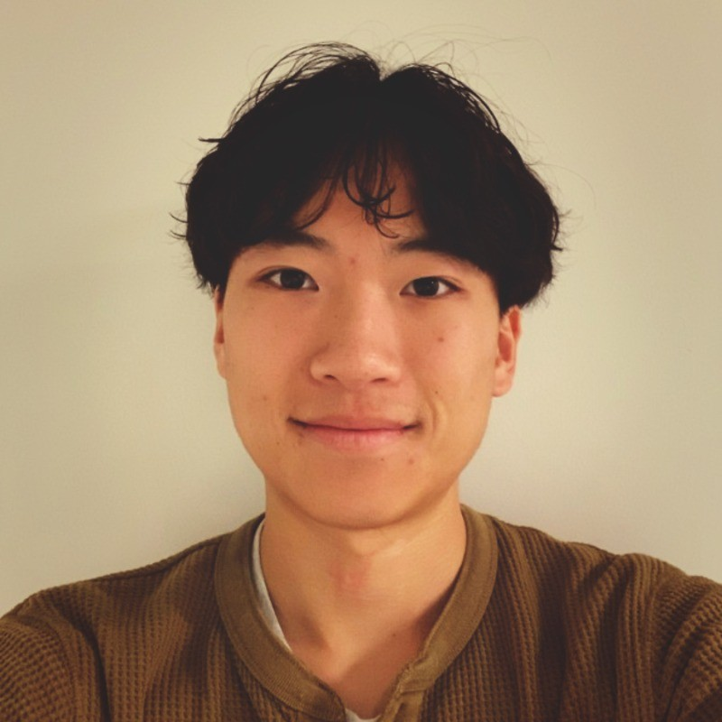

<link rel="stylesheet" href="/assets/css/styles.css">

{:style="float: right; padding: 30px; max-width: 30%; min-width: 330px;"}

 

Hi! I'm a 4th year undergrad at [UC Berkeley](https://www.berkeley.edu) studying Electrical Engineering and Computer Science (EECS). In the past, I've worked on disaggregated serving with the TensorRT-LLM team at Nvidia, robotics research under Sergey Levine, and kernels to bring up models at [Etched](https://x.com/Etched). I also competed at the ICPC representing Berkeley, and [used](https://github.com/timothygao8710/Problem-Setting/blob/main/Pancakes-II/pancakes-II-editorial.pdf) [to](https://github.com/timothygao8710/Problem-Setting/blob/main/Highways/Highways_Editorial.pdf) [write](https://github.com/timothygao8710/Problem-Setting/blob/main/Rating/rating-editorial.pdf) competitive programming problems in high school. I was D. E. Shaw Nexus Fellow, won the AI grand prize at Calhacks and Treehacks, and helped TA CS 189 at Berkeley. Outside of work, I enjoying playing soccer, [fingerstyle guitar](https://youtube.com/@timothygao9442), and karaoke.

Currently, I work on LLMs, check out my blog on [DiffusionGemma](https://mlberkeley.substack.com/p/the-annotated-diffusiongemma)!

Feel free to reach out at [timothygao at berkeley dot edu]!

<!-- If you like RLVR, you might like [Reasoning about Confidence](https://docs.google.com/presentation/d/1AhArRbct_EcK9Hzf-3rEhBKRjr38Qx4NyfMpVKNG9eY) and [Generalizing Temperature](https://timothygao8710.github.io/blogs/beyond-temperature/). 

If you like mechanistic interpretability, you might like [QK Visualizer](https://timothygao8710.github.io/QK-Visualizer/) and [KV lifetime](https://timothygao8710.github.io/blogs/kv-lifetime/).

If you like diffusionLLMs, you might like [The Annotated DiffusionGemma](https://colab.research.google.com/drive/17egFGmboDkhU6duNQHvjB1J0oiKslOMl?usp=sharing).

If you like competitive programming, you can check out [some](https://github.com/timothygao8710/Problem-Setting/blob/main/Pancakes-II/pancakes-II-editorial.pdf) [problems](https://github.com/timothygao8710/Problem-Setting/blob/main/Highways/Highways_Editorial.pdf) [I've](https://github.com/timothygao8710/Problem-Setting/blob/main/Rating/rating-editorial.pdf) written in the past. -->

---
